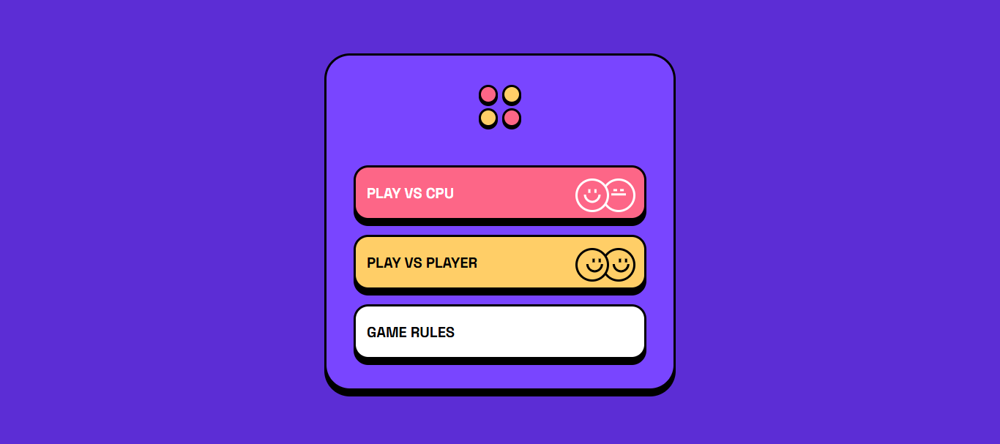

# Connect 4 Game

- A classic Connect Four game built using HTML, CSS, and JavaScript. This project uses Object-Oriented Programming (OOP) principles to structure game logic and interactions.

## Features
- Two-Player Mode: Players take turns dropping discs in a 7-column grid.
- CPU vs Player Mode: Challenge the computer with dynamic gameplay.
- Win Detection: Automatically checks for horizontal, vertical, or diagonal wins.
- Interactive Interface: Clickable columns and responsive visual feedback.
- OOP Structure: Game logic is encapsulated in classes for better organization and scalability.
- Reset Game: Easily restart the game with one click.

## Technologies Used
- HTML5
- CSS3
- JavaScript (OOP)
